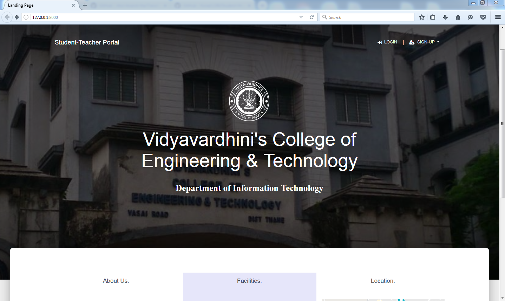
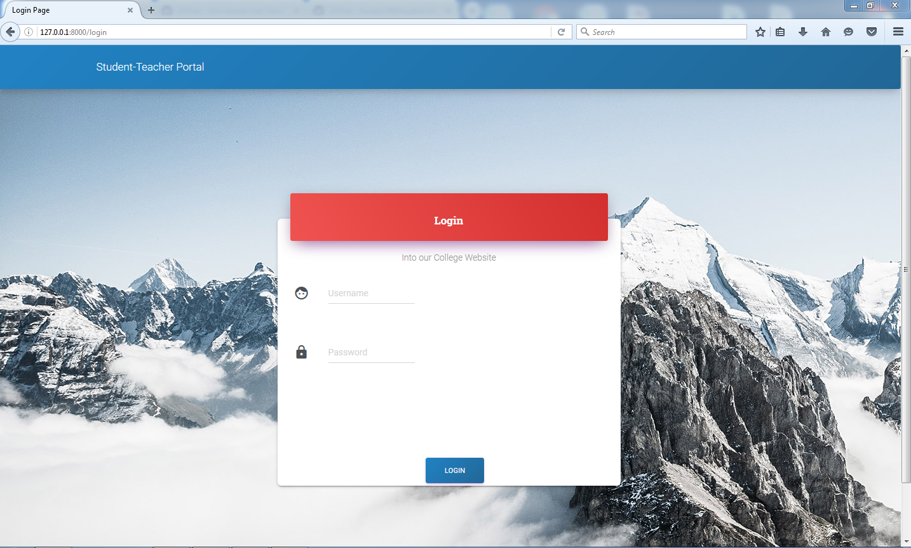
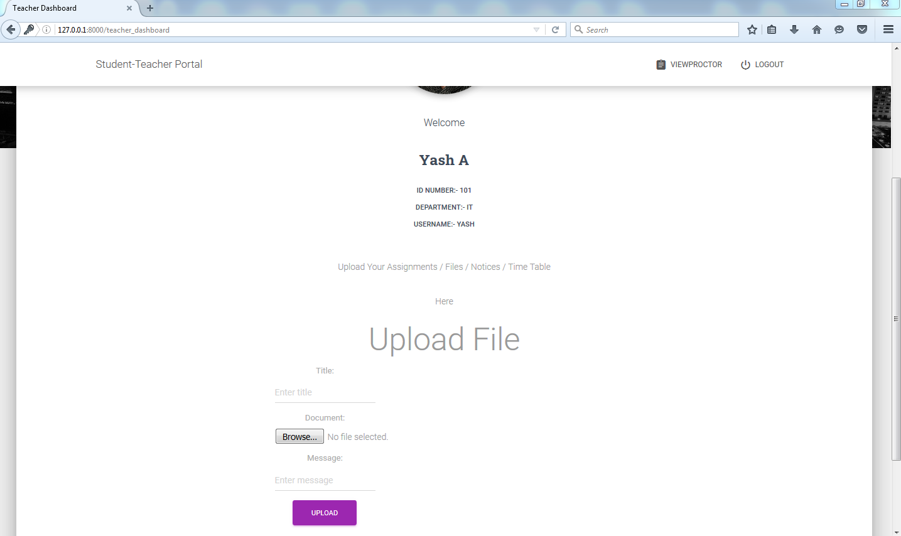

# Student-Management-System
It is an online Student-Teacher portal wherein teachers can upload various assignments related to their subjects which the student can download.

Also student proctor form facility is provided. This helps to maintain student data in a digital format thus reducing the paper work.

Technology used : Django (Python Framework), SQLite, HTML5, Materialize CSS. 

## ScreenShots

#### 1. Landing Page

#### 2. Login Page

#### 3. Student-Dashboard Page

#### 4. Teacher-Dashboard Page

